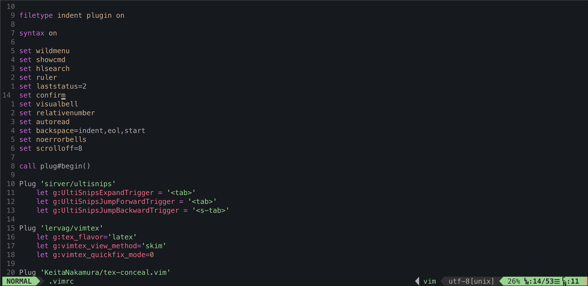

# Setup

This repository is all about setting up a new system for me or my friends, in particular setting up Vim and the commandline for taking notes or other work. The end product will look something like this:



but with additionally all the extra stuff that comes with UltiSnips. The knowledge required to figure this all out and make the snippet files, understanding how to use Git propery has (unfortunately) taken up many many tens of hours and the hope is that this page will make it easier to get it done quickly first time.

In order to make this work, you're going to need to set up a few things first, depending on your platform.

## Mac

If you're on a Mac, you're going to want to begin by installing Xcode's Command Line Tools. We aren't really going to be using them directly but occasionally other programs have them as a prerequisite.

```
xcode-select --install
```
That will probably take a while. Now we need to install **brew**, which will prove invaluable. 
```
/usr/bin/ruby -e "$(curl -fsSL https://raw.githubusercontent.com/Homebrew/install/master/install)"
brew update
```
The last line is probably unnecessary but we do it anyway. Now we're going to want to install a whole bunch of things with brew.
```
brew install vim python git node anaconda zsh
```
This will take absolutely ages but it's going to be worth it as we use all these things regularly. We now perform
```
chsh -s /bin/zsh
```
which changes the main shell to zsh. After this, you'll probably want to restart your machine. When it has started again, open up a terminal and see if it says zsh is the default (if it isn't, it might give a prompt for how to fix this). Then go get yourself `iTerm2`, as it has various features as a terminal that we like (especially the pane-splitting with `CMD-D`).
